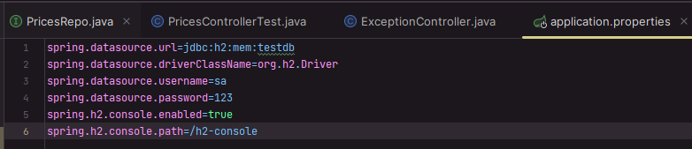
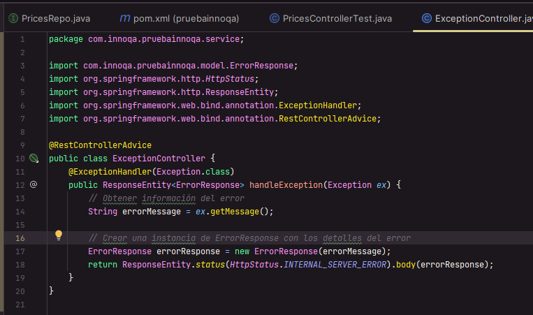

# PruebaInnoqa
Prueba técnica para Innoqa, usando SpringBoot 3.1.1 y Java 17. 

## Flujo de desarrollo

Lo primero que se hizo fue configurar la BD h2 en memorias mediante el archivo application.properties 

Luego empezamos a crear las entidades para darle forma a las tablas.

Luego se creo los @Repository utilizando la herencia a JPA para la conexión a la BD.

Luego se crearon los @RestController para construir los endpoint y generar las consultas.

Se crea un @RestControllerAdvice para controlar los errores en el código y asi validar el correcto funcionamiento del mismo

Por último, se crea un Util para realizar el mapeo de la salida y la lógica para validar si esta dentro de las fechas en la BD

## Flujo de test unitarios

Lo primero fue crear las etiquetas @SpringBootTest y @AutoConfigureMockMvc, se traen las clases principales a usar en los test con @Autowired y lo más importante para iniciar es el @BeforeEach en el cual se guardaran las 4 listas a la BD H2 antes de iniciar la ejecución de los test
